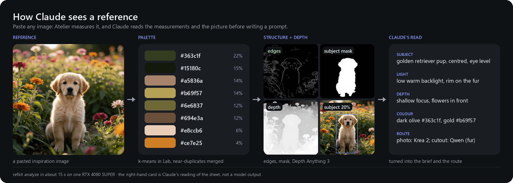
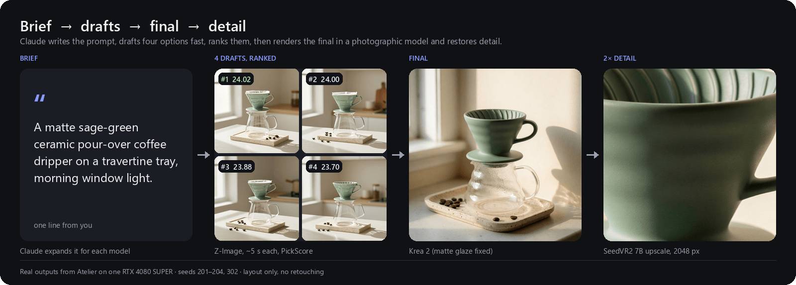
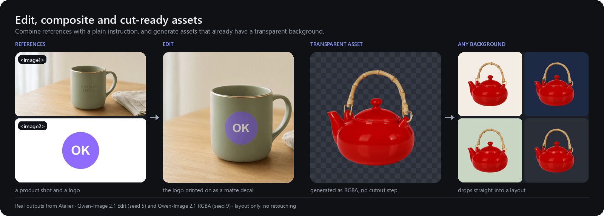
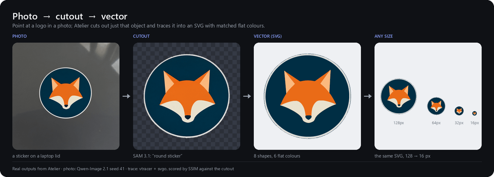
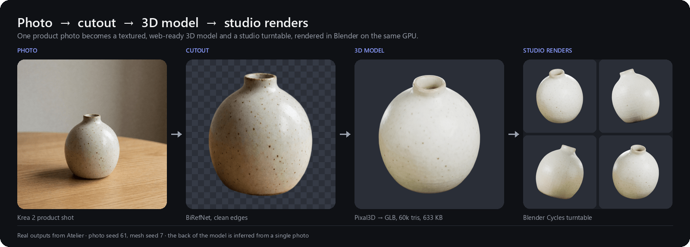
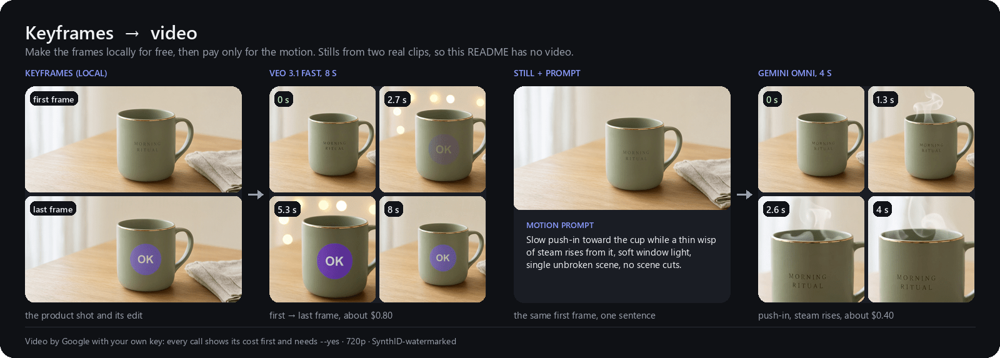
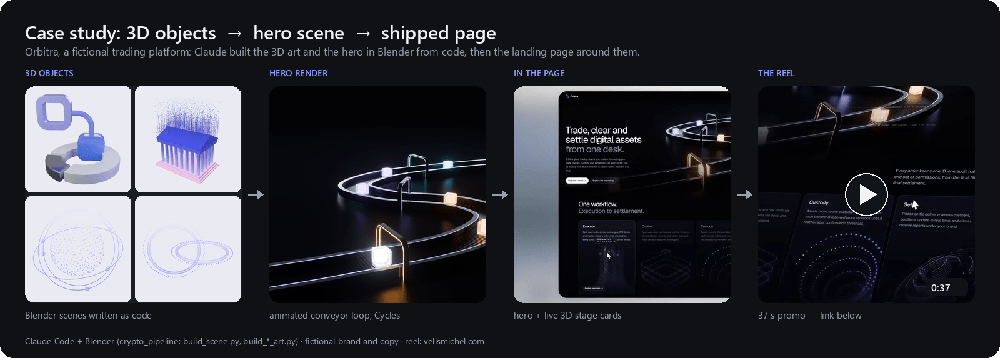

# Atelier

**Your GPU is the studio. Claude is the art director.**

Atelier turns your GPU into a design studio. Paste a reference, Claude art-directs, and your own machine delivers
the finished asset: vector, image, 3D model, turntable or video clip.

Every AI image tool gives you a picture. Atelier gives you a *deliverable*. Paste a screenshot or a sketch, and
Claude works like an art director: it analyzes the reference, picks the right model for the job, generates
options and ranks them, upscales the winner, and runs production QA on the result (halos, palette, file size,
loop seams). Logos become clean vectors, products become textured 3D models with studio turntables, stills become
video. Almost everything runs locally on one NVIDIA card with open models, so there are **no per-image fees**. The
cloud is used only when it's clearly better, and it tells you the cost before it spends a cent.

## See it work

Real Atelier outputs, made locally on one RTX 4080 SUPER. The video clips are the exception: Google generated
them, paid for with a Gemini API key. The layout is added afterwards; the images themselves aren't retouched.













**Case study: Orbitra.** A fictional trading platform. Claude built the 3D objects and the animated hero in Blender
from code (Cycles), then the landing page around them.
[▶ Watch the 37 s reel](https://velismichel.com/assets/works/blockchain/orbitra-reel.mp4)
([WebM](https://velismichel.com/assets/works/blockchain/orbitra-reel.webm)).

[](https://velismichel.com/assets/works/blockchain/orbitra-reel.mp4)

## What it makes

| You give it | You get | How |
|---|---|---|
| A logo, icon or screenshot | A clean, palette-exact SVG | trace → snap to exact hex → optimise → SSIM-scored against the reference |
| A brief or a reference | Product shots, posters, typography, UI art | Qwen-Image 2.1 / Krea 2 / HiDream-O1 / Ming / Z-Image, best-of-N ranked, SeedVR2 upscale |
| One or more reference images | Edits and composites that keep everything else intact | Qwen-Image 2.1 Edit (multi-reference), FLUX.2 klein |
| A photo | A cutout with clean edges, even on fur and glass | BiRefNet, SAM 3.1 ("the left cup"), Qwen matting |
| A photo or a turnaround | A textured, web-ready 3D model + studio turntable | Pixal3D (several seeds, optional multi-view refinement) → Blender cleanup, levelled on its base → meshopt/KTX2 → inspection sheet → Cycles render |
| A still or two keyframes | A video clip, upscaled and smoothed | Gemini Omni / Veo (cost-guarded) → SeedVR2 + frame interpolation locally |

## How it works

**Brief → analyze → route → generate and rank → refine and upscale → QA → look again.**
Claude reads the reference (palette, shapes, light, typography), chooses the model that fits the job, writes the
prompt that model wants, and compares the result side by side with the reference until it holds up.

- **Deliverables, not pictures.** Built-in QA checks edge halos, exact colours, file-size budgets, embedded prompt
  metadata, misspelt text, broken 3D meshes, video faststart and turntable loop seams.
- **A second pair of eyes.** Reward models (HPSv3++, EditScore) and a local vision model rank candidates and check
  multi-view consistency before Claude looks, so Claude spends its attention on the best two or three.
- **Every output is traceable.** A sidecar per file records model, licence, seed, prompt and input hashes;
  `--json` gives Claude machine-readable results.
- **Local first.** Open models on your own GPU. Google (Nano Banana, Gemini Omni, Veo) only when it's clearly
  better, always with a cost estimate, an explicit `--yes` and a spend log.
- **The right model for each job.** Fast drafts, photographic finals, typography, edits, cutouts, 3D and video
  each route to a different model.
- **Keeps itself working.** A smoke test after every update re-exports and validates the workflows; a built-in
  benchmark picks the fastest safe settings (Comfy Kitchen attention: 14-18% faster Qwen/Krea/klein images and
  10-16% faster 3D on an RTX 4080 SUPER, measured with the same seeds).

## A quick taste

```powershell
refkit gen "matte sage-green ceramic cup, soft window light" -m krea -n 4 --pick   # 4 options, ranked
refkit upscale krea-1234.png --long 3840                                          # SeedVR2 detail restore
refkit cutout photo.jpg --prompt "the cup"                                        # just that object
refkit to3d photo.refkit/cutout-the_cup.png -n 3 --seed 7 --out cup3d           # 3 textured GLBs + compare.png
refkit render cup3d/pixal3d-8/model.glb --frames 96 --ground                      # the chosen seed, turntable
refkit video "slow push-in, steam rises" --from still.png --yes                   # paid: shows cost first
refkit qa cup3d/pixal3d-8/model.glb                                               # production checks
```

## Requirements

- **Windows 11 + an NVIDIA GPU with 16 GB** (built and tested on an RTX 4080 SUPER). The local models use
  CUDA-only kernels; macOS isn't supported today.
- About 130 GB for models; Blender 5.2, ffmpeg and ComfyUI (portable). Full list with versions: `REQUIREMENTS.md`.
- **Claude Code** (needs a Claude plan or API access). Optional: a Google Gemini API key for paid cloud images
  and video.
- **Model licences:** Qwen-Image 2.1 is non-commercial and Krea 2 is free under $1M revenue. For commercial work,
  use Z-Image, FLUX.2 klein or Nano Banana.

## Repository layout

| Path | What |
|---|---|
| `studio/refkit/` | `refkit` CLI: analyze, cutout, vectorize, gen, upscale, to3d, render, video, qa, status, smoke, bench |
| `studio/workflows/` | ComfyUI API workflows exported from ComfyUI's core templates (`refkit smoke` re-exports them) |
| `studio/tokens*.json` | QA budgets (style-neutral) and project design tokens |
| `nanobanana.py` | Google Gemini API client: Nano Banana images, Gemini Omni / Veo video, cost guard + spend log |
| `claude/skills/` | Claude Code skills: `refkit` (how Claude drives Atelier), `motion` |
| `Setup.cmd` | Double-click installer: opens the setup screen (`setup/install.ps1`) |
| `setup/` | Setup screen (`install.ps1`), installers (`08`, `09`), `link-skills.ps1`, the weekly `update-tools.ps1`, `90-check.ps1`; templates for the shims, workflow exporter and model fetcher |
| `requirements.txt` / `requirements-lock.txt` | Python deps (CUDA torch index) / exact installed versions |
| `REQUIREMENTS.md` | Platform, tools + versions, ComfyUI + torch, every model file (generated weekly) |

## Install

```powershell
git clone https://github.com/michelve/atelier.git
cd atelier
.\Setup.cmd          # or double-click Setup.cmd in Explorer
```

**Setup.cmd** opens the Atelier setup screen. It lists every step with its live status and runs them in order.
It installs PowerShell 7 first if you don't have it. Press **Enter** to run everything that isn't done yet, or
type a step's number to run just that one. On a fresh machine it looks like this:

```text
  Atelier setup   repo D:\atelier

   1. [done] System check               NVIDIA GeForce RTX 4080 SUPER, 16 GB, driver 616.92
   2. [todo] Prerequisites              missing: uv (Python manager), Blender, Scoop
   3. [todo] Engine folder              not chosen yet (default would be D:\atelier\engine)
   4. [todo] Visual tools               missing: vtracer, svgo, gltf-transform, ...
   5. [todo] Local AI stack             not installed
   6. [todo] Claude Code + skills       Claude Code not installed; skills 0/2, Blender MCP not connected
   7. [todo] Verify                     not run yet
   8. [todo] Gemini API key *           not set (local generation works without it)
   9. [todo] Weekly updates *           not scheduled
  10. [todo] Tune speed for this GPU *  not run
      * optional
```

| Step | What happens |
|---|---|
| 1. System check | Confirms Windows 11 and an NVIDIA GPU + driver, and shows your VRAM (16 GB recommended). |
| 2. Prerequisites | Installs whatever is missing: Git, uv, Python, Node.js, 7-Zip, Blender, FFmpeg, ImageMagick, ExifTool, oxipng, Scoop, Playwright. |
| 3. Engine folder | **Asks where Atelier's engine should live** (ComfyUI, ~130 GB of models, the Python venv). Shows free space per drive and saves your choice as `ATELIER_ENGINE`. You don't need to create anything yourself. |
| 4. Visual tools | Runs `setup\08-visual-tools.ps1`: vectorizers, glTF/KTX tools, Inkscape, f3d, the `blender` command, Blender MCP. |
| 5. Local AI stack | Runs `setup\09-local-ai.ps1`: ComfyUI, the models (a long download that resumes if interrupted), the venv, the workflows, the `refkit` and `comfy` commands, and the Claude Code skills. |
| 6. Claude Code + skills | Installs [Claude Code](https://claude.com/claude-code) with the official installer if it's missing (asks first), links Atelier's skills into `~\.claude\skills` so every Claude session can use them, and connects Blender MCP to Claude Code. Then sign in once by running `claude`. |
| 7. Verify | Runs `refkit status` and `refkit smoke`: a tiny end-to-end generation and cutout. |
| 8.–10. Optional | A Gemini API key for paid cloud images and video (entered hidden), weekly auto-updates (asks for admin), and `refkit bench` to tune ComfyUI's speed flags for your GPU. |

Every status is read from the machine, so you can close the screen, come back later and continue. Scripted
installs: `.\Setup.cmd -All -Engine D:\AtelierEngine` (add `-SkipModels` to download the models later), or
`.\Setup.cmd -Step 6` to run a single step.

<details>
<summary>Manual install (what the setup screen does)</summary>

```powershell
# 1. Prerequisites
'Git.Git', 'astral-sh.uv', 'Python.Python.3.13', 'OpenJS.NodeJS.LTS', '7zip.7zip', 'BlenderFoundation.Blender',
'Gyan.FFmpeg', 'ImageMagick.ImageMagick', 'OliverBetz.ExifTool', 'Shssoichiro.Oxipng', 'UB-Mannheim.TesseractOCR' |
  ForEach-Object { winget install --id $_ -e }
irm get.scoop.sh | iex
python -m pip install playwright; python -m playwright install chromium

# 2. Engine folder (optional; default <repo>\engine)
[Environment]::SetEnvironmentVariable('ATELIER_ENGINE', 'D:\AtelierEngine', 'User'); $env:ATELIER_ENGINE = 'D:\AtelierEngine'

# 3. Install, then check
pwsh -File setup\08-visual-tools.ps1
pwsh -File setup\09-local-ai.ps1      # also links the skills (setup\link-skills.ps1)

# 4. Claude Code: install, sign in once, connect Blender MCP
irm https://claude.ai/install.ps1 | iex
claude
claude mcp add --scope user blender -- blender-mcp
refkit status; refkit smoke          # in a new terminal
```

Weekly updates: `setup\06-schedule.ps1` from an elevated shell. It schedules `setup\update-tools.ps1`, which
updates refkit's Python packages and ComfyUI (latest stable), runs `refkit smoke` over both, and refreshes
`REQUIREMENTS.md`. Run `setup\update-tools.ps1 -Part User -Check` (or `-Part Admin -Check`) to see what is behind
without installing anything. Set `ATELIER_REPOS` to a folder of git repos to get a weekly fetch report too.
</details>

`setup\00`–`07` are an optional, opinionated Windows dev-environment bootstrap (shell, fonts, document tools,
editor settings). Atelier itself only needs the setup screen, which runs `08` and `09`.

Git-ignored: `engine/`, generated output (`images/`, `scratch/`, `web/`, `*.refkit/`), personal files (`docs/`,
the Gemini spend log) and `setup/backup/`, `setup/logs/`.

## License

MIT, see [LICENSE](LICENSE). The workflows in `studio/workflows/` are exported from ComfyUI's workflow templates
(MIT, © Comfy Org). The licence covers Atelier's own code and docs only: the models it downloads keep their own
licences (see Requirements), and so do ComfyUI, Blender and the other tools it installs.
